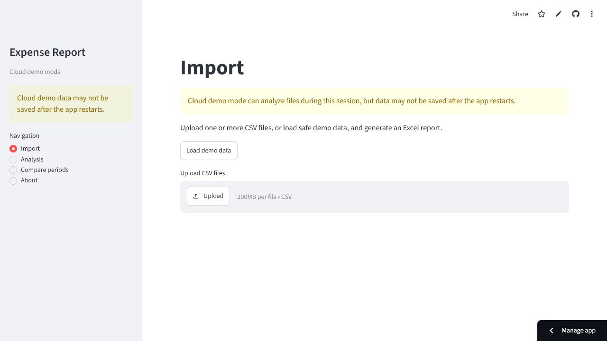

# Expense Report Generator

[Live app](https://codex-expense-report-svn4nbnebia6tzqvvvn9st.streamlit.app/)

Expense Report Generator is a small learning project for analyzing expense CSV
files. It validates data, creates Excel reports, shows charts, stores local
imports in SQLite, and can also run as a simple cloud demo in Streamlit.

The project is designed for beginners: the code is split into small modules, the
CSV format is simple, and the app can be used from the browser or from the
command line.

## Screenshot



## Main Features

- Upload one or more CSV files.
- Load safe demo data from `data/demo_expenses.csv`.
- Validate CSV files before creating reports.
- Show clear validation errors.
- Combine several correct CSV files into one table.
- Add a `month` column from the `date` column.
- Show summary metrics.
- Analyze expenses by category and by month.
- Build charts in Streamlit.
- Compare two date periods.
- Create downloadable Excel reports.
- Save imports into a local SQLite database in local mode.
- Show import history in local mode.
- Delete selected imports in local mode.
- Skip duplicate expense rows when saving to SQLite.
- Run automated tests with `pytest`.

## Project Structure

```text
.
|-- README.md
|-- AGENTS.md
|-- STREAMLIT_CLOUD.md
|-- requirements.txt
|-- .gitignore
|-- run_streamlit.bat
|-- run_tests.bat
|-- run_report.bat
|-- data/
|   |-- .gitkeep
|   |-- expenses.csv
|   |-- expenses_bad.csv
|   |-- demo_expenses.csv
|   `-- monthly/
|       |-- expenses_2026_01.csv
|       |-- expenses_2026_02.csv
|       `-- expenses_2026_03.csv
|-- src/
|   |-- app.py
|   |-- app_config.py
|   |-- analyze_expenses.py
|   |-- analytics.py
|   |-- database.py
|   |-- importer.py
|   |-- logging_config.py
|   |-- report.py
|   |-- session_data.py
|   |-- validate_data.py
|   `-- sections/
|       |-- import_section.py
|       |-- history_section.py
|       |-- analysis_section.py
|       |-- compare_periods_section.py
|       `-- about_section.py
|-- tests/
|   |-- test_database.py
|   |-- test_multi_csv_analysis.py
|   `-- test_validate_data.py
`-- output/
    |-- generated reports
    `-- run_log.txt
```

The `output/` folder is for generated files only. It is ignored by Git.

## Requirements

You need Python installed on your computer.

The project uses these Python libraries:

- `pandas`
- `openpyxl`
- `pytest`
- `flask`
- `streamlit`

They are listed in `requirements.txt`.

## Install Dependencies

Open a terminal in the project folder and run:

```bash
pip install -r requirements.txt
```

On Windows, some `.bat` files also install dependencies before running.

## Run Streamlit Locally

The main Streamlit file is:

```text
src/app.py
```

Run the app with:

```bash
streamlit run src/app.py
```

If that command does not work, use:

```bash
python -m streamlit run src/app.py
```

On Windows, you can also double-click:

```text
run_streamlit.bat
```

After starting, open this address in the browser:

```text
http://localhost:8501
```

## Run from the Command Line

The command-line script is:

```text
src/analyze_expenses.py
```

Default run:

```bash
python src/analyze_expenses.py
```

Run with custom input and output files:

```bash
python src/analyze_expenses.py --input data/expenses.csv --output output/expense_report.xlsx
```

The command-line mode validates the CSV, prints results in the console, creates
an Excel report, and writes a log entry.

## CSV File Format

Each CSV file must have these columns:

```text
date,category,description,amount
```

Example:

```text
2026-01-15,Food,Groceries,34.25
```

Column rules:

- `date` must be a valid date.
- `category` must not be empty.
- `description` can be text.
- `amount` must be a number.
- `amount` must not be negative.

Allowed example categories:

- `Food`
- `Transport`
- `Rent`
- `Shopping`
- `Health`
- `Other`

## Data Validation

Validation is handled in:

```text
src/validate_data.py
```

The app checks:

- required columns exist;
- dates are not empty;
- categories are not empty;
- amounts are numeric;
- amounts are not negative;
- dates can be converted to real dates.

If a CSV file has errors, the app shows the errors and does not create an Excel
report from bad data.

## SQLite Database

Local database logic is in:

```text
src/database.py
```

The local database file is:

```text
data/expenses.db
```

The database is created automatically when needed. It is not committed to Git.

The database has two main tables:

- `imports` stores information about each import.
- `expenses` stores expense rows connected to an import.

The History section uses this database in local mode.

## Duplicate Protection

When expenses are saved to SQLite, each row gets a `row_hash`.

The hash is based on normalized values:

- `date`
- `category`
- `description`
- `amount`

Before creating the hash, the app:

- converts dates to `YYYY-MM-DD`;
- trims extra spaces in text;
- converts empty descriptions to an empty string;
- formats amounts with the same precision.

If the same expense row is imported again, it is skipped instead of being saved
twice.

## Analysis and Filters

The Analysis section can show:

- total expenses;
- average expense;
- maximum expense;
- minimum expense;
- number of expenses;
- number of categories;
- number of months;
- expenses by category;
- expenses by month;
- Month x Category table;
- charts;
- filtered source rows.

Available filters:

- start date;
- end date;
- categories;
- imports, in local mode;
- text search in `description`.

In cloud mode, Analysis uses data loaded in the current browser session.

## Compare Periods

The Compare periods section lets the user select:

- Period A start date;
- Period A end date;
- Period B start date;
- Period B end date.

For each period, the app shows:

- total amount;
- average expense;
- maximum expense;
- number of expenses;
- number of categories.

It also shows:

- absolute total difference;
- percentage change, if Period A total is not zero;
- average expense difference;
- expense count difference;
- category comparison table;
- comparison chart by category.

If one period has no data, the app shows a message instead of crashing.

## Excel Reports

Excel report creation is handled in:

```text
src/report.py
```

Reports can include these sheets:

- `Raw Data` or `Filtered Data`
- `Summary`
- `By Category`
- `By Month`
- `Month x Category`
- `Validation`

The Validation sheet checks that totals match and that the report has rows.

In Streamlit, the user can download the Excel report from the browser.

## Run Tests

Tests are stored in:

```text
tests/
```

Run tests with:

```bash
pytest
```

Or:

```bash
python -m pytest
```

On Windows, you can also double-click:

```text
run_tests.bat
```

The tests check validation, CSV combining, monthly analysis, category analysis,
SQLite behavior, duplicate protection, filtered reports, and command-line mode.

## APP_MODE

The Streamlit app supports two modes:

```text
APP_MODE=local
APP_MODE=cloud
```

If `APP_MODE` is not set, the app uses:

```text
local
```

## Local Persistent Mode

Use:

```text
APP_MODE=local
```

This mode is for local work on your computer.

It:

- uses `data/expenses.db`;
- allows saving imports;
- shows History;
- allows deleting selected imports;
- keeps saved data between local app restarts.

## Cloud Demo Mode

Use:

```text
APP_MODE=cloud
```

This mode is for the published Streamlit Community Cloud demo.

It:

- lets users upload CSV files;
- lets users load `data/demo_expenses.csv`;
- analyzes data from the current session;
- compares periods from the current session;
- creates downloadable Excel reports;
- does not promise persistent SQLite storage.

Important: data in the cloud demo may disappear after the app restarts.

## Publish to Streamlit Community Cloud

Before publishing, make sure the project is on GitHub.

In Streamlit Community Cloud:

1. Create a new app.
2. Select this GitHub repository.
3. Set the main file path to:

```text
src/app.py
```

4. Set this environment variable:

```text
APP_MODE=cloud
```

5. Deploy the app.

The app does not need secrets for the current demo version.

Do not commit this file:

```text
.streamlit/secrets.toml
```

The `.gitignore` file already excludes local databases, generated reports, logs,
cache folders, virtual environments, and secret files.

## Demo Data

The demo CSV file is:

```text
data/demo_expenses.csv
```

It contains only fictional data. It must not contain real names, addresses,
banking data, passwords, tokens, or other personal information.

## Logs

The app writes local log entries to:

```text
output/run_log.txt
```

The `output/` folder is ignored by Git because it contains generated local
files.
